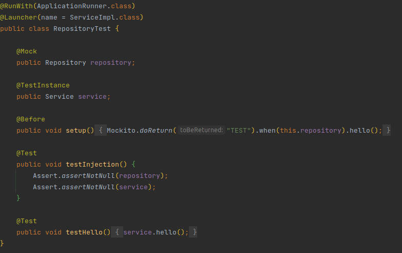

# Guice Dependency Injection

A little example of how to use guice for create your application with a dependency injection manager

Dependency Injection Module

- Application Context has the responsibility of to start the application and the dependency manager
- Dependency Module search and collect all classes marked with Component
- App is main annotation, so you can choose the package where you start the application
- OnStart, OnStop are method annotation for launch specific logic on start event and on stop event
- Component is an annotation for mark every singleton class in your application

Follow an example of test class
- ApplicationRunner launches your application with the help of the Launcher annotation which contains the link of the class to be tested
- Mock create and inject a mocked object instance into test class and tested class
- TestInstance is mandatory for obtain the instantiated test class

Another example

